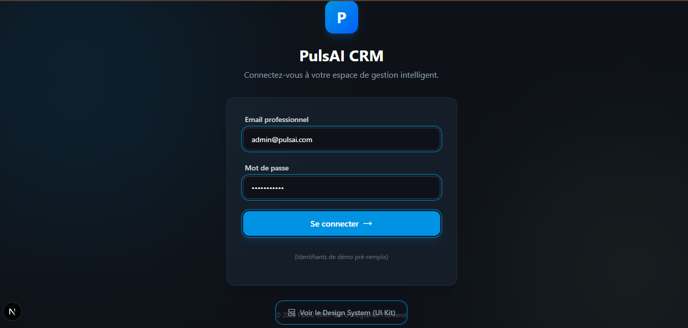
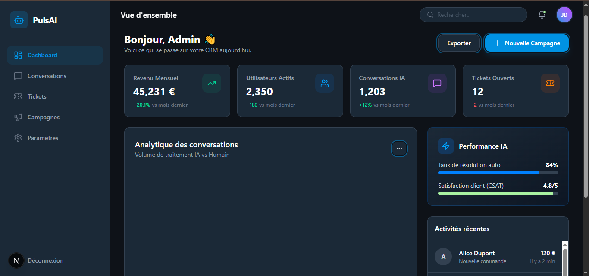
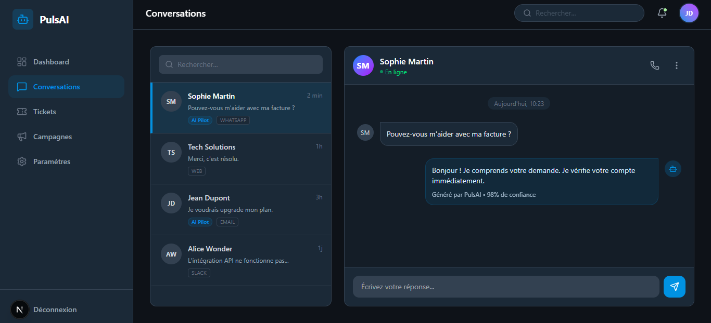
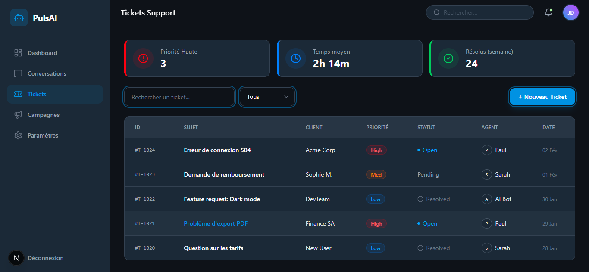
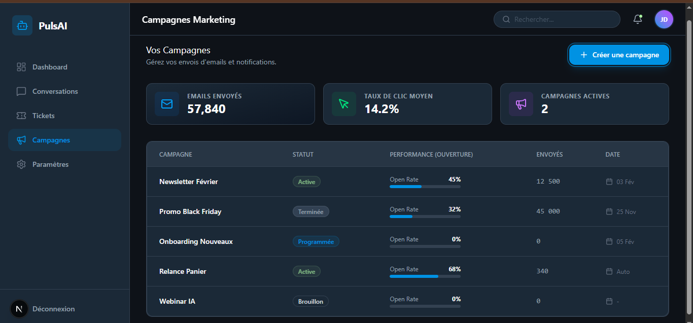
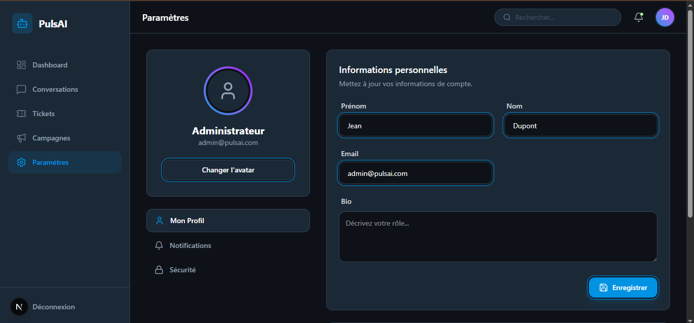

# 🚀 PulsAI CRM

Dashboard SaaS moderne développé avec **Next.js**, **Tailwind CSS v4** et **Framer Motion**.
Conçu pour être performant, accessible et scalable.

## 🛠 Stack Technique

- **Framework** : Next.js 15 (Pages Router)
- **Styling** : Tailwind CSS v4
- **Animations** : Framer Motion
- **Icônes** : Lucide React
- **Polices** : Next/Font (Ubuntu & Unbounded)
- **UX** : NProgress, Glassmorphism design

## 📂 Structure du Projet

```bash
pulsai-crm/
├── components/
│   ├── ui/           # Composants atomiques (Button, Card, Badge...)
│   └── layout/       # Sidebar, Header
├── layouts/          # Wrappers globaux (DashboardLayout)
├── pages/            # Routes (Dashboard, Tickets, Campaigns...)
├── data/             # Mock Data (Simulation Backend)
├── utils/            # Helpers (cn, formatters)
└── styles/           # CSS Global & Thème Tailwind v4
```

## 🚀 Installation & Démarrage

1. **Cloner le projet**

```bash
git clone https://github.com/votre-user/pulsai-crm.git
cd pulsai-crm
```

2. **Installer les dépendances**

```bash
npm install
```

3. **Lancer le serveur de développement**

```bash
npm run dev
```

Ouvrez [http://localhost:3000](http://localhost:3000) pour voir le résultat.

## 📄 Pages Implémentées

- **Dashboard** (`/dashboard`) : Vue d'ensemble avec KPIs et graphiques.
- **Conversations** (`/conversations`) : Chat interface type Crisp/Intercom.
- **Tickets** (`/tickets`) : Gestionnaire de tickets style Kanban/Liste.
- **Campagnes** (`/campaigns`) : Outil d'automatisation marketing.
- **Paramètres** (`/settings`) : Configuration du compte.
- **Login** (`/`) : Page d'accueil / Connexion.

## 📸 Captures d'écran

| Page de Connexion / Accueil   | Dashboard (Vue d'ensemble)        |
| ----------------------------- | --------------------------------- |
|  |  |

| Conversations / Chat                  | Tickets & Support               |
| ------------------------------------- | ------------------------------- |
|  |  |

| Campagnes Marketing               | Paramètres                       |
| --------------------------------- | -------------------------------- |
|  |  |

### Autres vues et détails (Mobile / Tablette)

|             Détail 1             |             Détail 2             |             Détail 3             |
| :------------------------------: | :------------------------------: | :------------------------------: |
|  |  |  |
